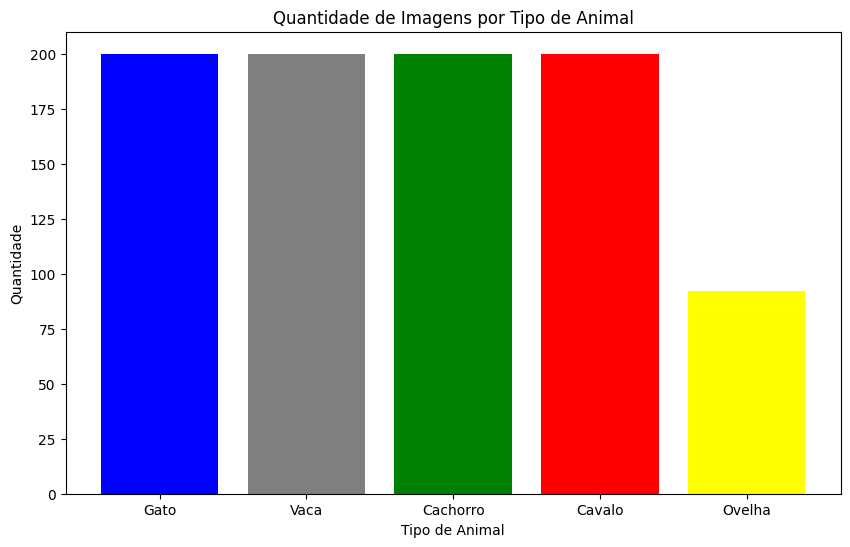
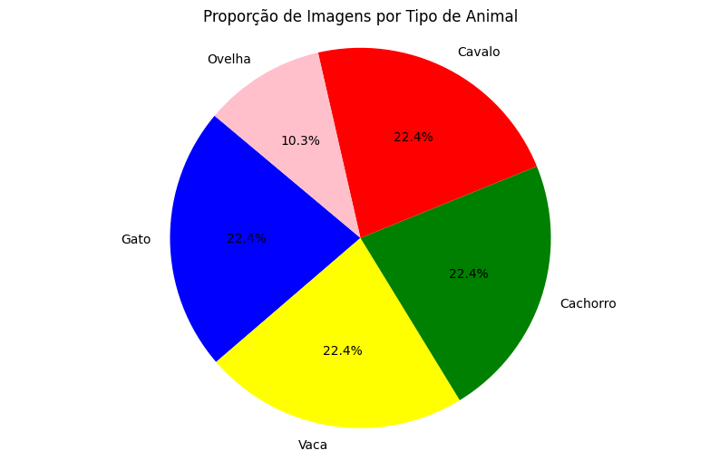
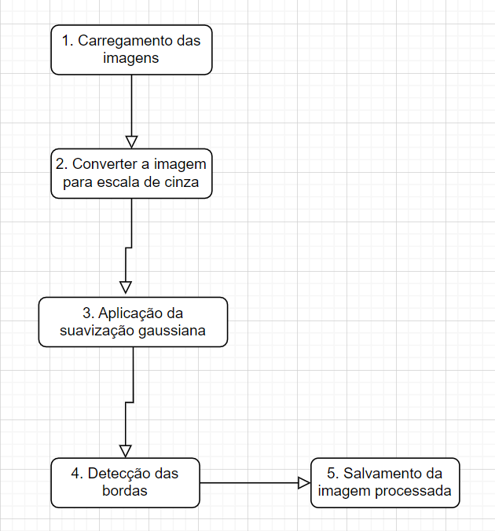
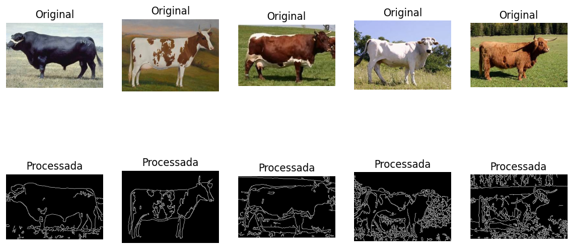

# Ponderada Pose Estimation

## 1 - Análise Exploratória

### Gráfico de Barras

O gráfico de barras mostra a quantidade de imagens por tipo de animal no dataset. As barras de diferentes cores representam cada tipo de animal, permitindo uma comparação fácil da quantidade de imagens entre os diferentes tipos.

### Gráfico de Pizza

O gráfico de pizza representa a proporção de imagens de cada tipo de animal no dataset. As fatias da pizza são coloridas de acordo com o tipo de animal, mostrando visualmente a distribuição das imagens.

Com base nos gráficos acima, podemos concluir que a quantidade de bovinos presentes no dataset é igual a 200.

## 2 - Processamento Das Imagens

### Figura ilustrativa do processo

A figura acima representa o processo realizado para processar as imagens. Primeiro, a imagem é carregada utilizando a biblioteca cv2. Após isso, é implementada uma conversão para escala de cinza utilizando a biblioteca cv2. No próximo passo é realizado uma suavização gaussiana para reduzir o ruído na imagem, novamente utilizando o pacote cv2. Em sequência é realizada a detecção de bordas, utilizando o algoritmo Canny. Por fim, a imagem é salva em uma pasta só para bovinos.

### Imagens processadas

A seguir é apresentado algumas das imagens originais de bovinos e suas versões processadas lado a lado. A imagem processada é convertida para escala de cinza, suavizada e as bordas são destacadas usando o algoritmo Canny.

## 3 - Resultados Finais

### Gráfico de Barras

O gráfico de barras mostra a quantidade de imagens por tipo de animal no dataset. As barras de diferentes cores representam cada tipo de animal, permitindo uma comparação fácil da quantidade de imagens entre os diferentes tipos.

### Gráfico de Pizza

O gráfico de pizza representa a proporção de imagens de cada tipo de animal no dataset. As fatias da pizza são coloridas de acordo com o tipo de animal, mostrando visualmente a distribuição das imagens.

### Tabela de resultados

Tabela de contagem de imagens por tipo de animal

| Animal                | Count                                           |
|------------------------|------------------------------------------------|
| Gato      | 200                                |
| Vaca | 200 |
| Cachorro | 200                                        |
| Cavalo | 200                                             |
| Ovelha | 92                                             |

### Visualização de Imagens

A visualização das imagens apresenta algumas das imagens originais de bovinos e suas versões processadas lado a lado. A imagem processada é convertida para escala de cinza, suavizada e as bordas são destacadas usando o algoritmo Canny.

## 4 - Conclusão

O aprendizado principal que obtive com essa atividade é sobre a importância da aplicação das técnicas de processamento de imagem, pois ela ajuda a destacar características importantes das imagens, como bordas e contornos, facilitando análises futuras. Com relação às limitações desse trabalho, acredito que por conta das categorias reduzidas de animais, isso tornou o trabalho mais fácil e menos complexo. Uma tarefa mais desafiadora para o futuro seria a de trabalhar com mais dados e dados mais complexos. Por fim, uma sugestão de trabalho futuro seria a de utilizar a visão computacional para ajudar em tarefas de carros autônomos, pois acredito que podemos utilizar os conceitos aprendidos para realizar trabalhos mais complexos.